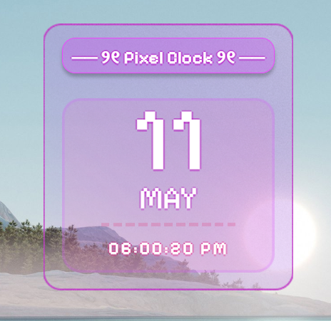

# Pixel-Clock 

A pixel-style desktop clock app built with HTML, CSS, JavaScript, and ElectronJS.

---
## Features

- Real-time digital clock
- Pixel-inspired UI
- Smooth animations
- Desktop app using ElectronJS

---
## Design File

Figma design:
https://www.figma.com/design/PfPBBhINCaqvp9ni2dexf1/calendar?node-id=40-2&t=EVwfwBGakExLxPJu-1


---

# Project Structure

| File | Purpose |
|------|----------|
| `  index.html  ` | Main UI layout |
| `  styles.css  ` | Styling |
| `  script.js  ` | Clock functionality |
| `  main.js  ` | Electron setup |
| `  assets/  ` | Images & icons |

---

## How to use

### 1. Clone This Repo

```bash
https://github.com/spandana-yellamelli/Pixel-Clock.git
```
### 2. Install Node.js

```bash
npm install
```
### 3. Run the App Locally
```bash
npm run start
```
## Tech Stack

- HTML
- CSS
- JavaScript
- ElectronJS
  
---

## Preview




---

# Author

### Spandana Yellamelli
